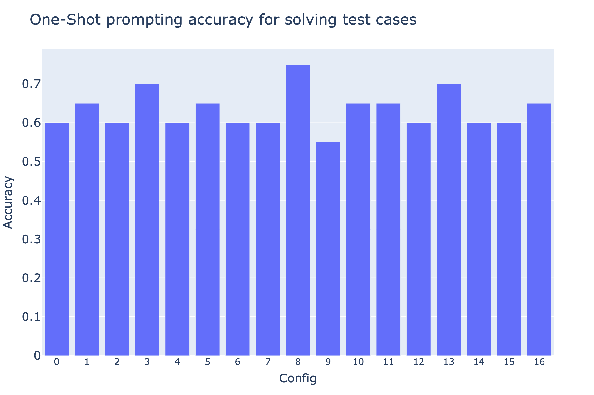

# llms-using-rag-for-docs

Today, Large Language Models (LLMs) show fascinating abilities when it comes to generating code. However, they have a major shortcoming: they learn coding by sheer repetition and develop their zero-shot capabilities through studying code samples. This prevents the model from scaling beyond what is included in the training data as well as using versions of packages/libraries that emerged after the model was trained.
Hence, we propose a Retriever Augmented Generation (RAG) framework that accesses a vector database with the encoded documentation of every function of a package in its latest version. On request, the agent matches the user input query to the function that is most likely needed in order to generate the code for achieving what the user wants to do. This enables up-to-date knowledge of Python libraries such as pandas without expensive retraining of the LLM. Through automated experiments employing various configurations and test cases, our study demonstrates the superior performance of RAG (+4\%) and CoALA (+6\%) over the absence of RAG in diverse coding scenarios. The evaluation, spanning different prompting styles and scenarios, provides valuable insights into the strengths and trade-offs of various configurations, contributing to informed decisions in deploying AI agents for code generation.

## Results

In our experiments, we employed three distinct prompting styles to assess the performance of the AI agent. The first approach utilized was Zero-Shot prompting, where the prompt was presented as a single paragraph without specific formatting, aiming to gauge the model's ability to generate responses based solely on general context. The second technique, Zero-Shot structured prompting, involved clearer prompts and a more organized format, breaking down the prompt into user questions, input data, and incorporating line breaks to enhance clarity and minimize the likelihood of the LLM misinterpreting the prompts. This method aimed to evaluate if a structured input could enhance the model's understanding and generation. Lastly, we explored One-Shot prompting, where a user question, input, and desired output were provided together, testing the model's capability to comprehend and generate responses based on a single set of instructions. The results from these varied prompting styles are listed below.

One-Shot prompting results (view [details](results/pandas_one_shot.csv)):



Zero-Shot structured prompting results (view [details](results/pandas_zero_shot_structured.csv)):


Zero-Shot prompting results (view [details](results/pandas_zero_shot.csv)):


## Get Started

Please make sure you use 3.10 <= Python version <= 3.11. To install the packages run:

```
pip install -r requirements.txt
```

Please check out:

- [Demo](demo.ipynb) for a showcase on how to use an AI agent.
- [Evaluation](evaluation.ipynb) for a glimpse on the automated code generation evaluation.
- [Slides](docs/NLP%20Project%20Slides.pdf) to find the presentation on this topic.
- [Paper]() to find the project report with the details of the experiments and results.

As everything has been implemented from scratch the code includes the following:

- [ReActAgent](llms/agents) for an implementation of ReAct prompting.
- [LLM clients](llms/clients/) for the API clients.
- [Auto evaluation](llms/evaluation/) for the automated code evaluation using a config grid. When running Auto Evaluation, embeddings will be generated automatically. The results of the run can be found in the [results](results) folder and the details of the run can be found in [details](results/details/) folder.
- [RAG/CoALA](llms/rag) for an implementation of RAG/CoALA using FAISS.
